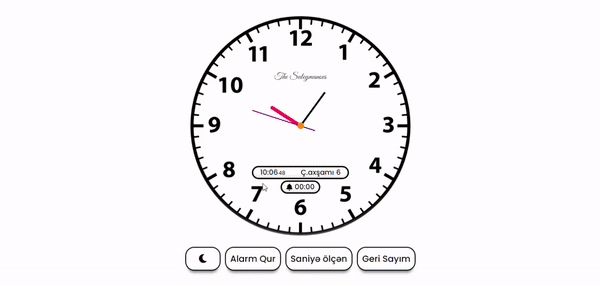

# Analog-Watch-and-Functions (Pure Java Script)

 ### 
 1. [Demo](https://fuadsuleymanli.com/Demos/watch) 
 2. [Demo (Codepen.io)](https://codepen.io/sooleymanli/pen/JjEyGzL?editors=0110L)
 3. [Demo (Github.io)](https://sooleymanli.github.io/Analog-Watch-and-Functions/)

###

## Functions
1. Analog Watch
2. Digital Watch
3. Day of the Week
4. Day
5. Set Alarm
6. Choose Alarm Music
7. Timer
8. Secundamer
9. Night Mode

